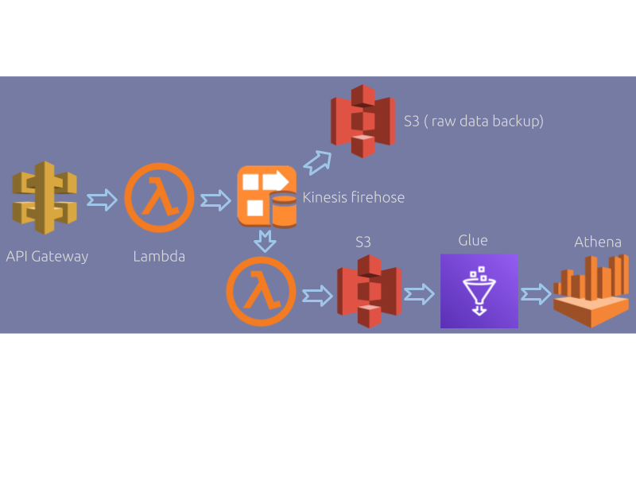

## User data analytics pipeline using AWS services

### Table of Contents
1. [Introduction](README.md#introduction)
1. [Data pipeline](README.md#data-pipeline)
1. [How to setup the pipeline](README.md#how-to-setup-the-pipeline)
1. [Future work](README.md#future-work)
1. [Contact Information](README.md#contact-information)


### Introduction
This repository provides an API endpoint for posting user details such as name, address and contact in a JSON format. Specific records of interest are then extracted and stored in an S3 bucket for further analysis.

### Data pipeline 

###### API Gateway
AWS API Gateway is used to provide a REST API.

###### Backend
Lambda function is chosen as a backend to process requests because it is well suited to the use-case compared to a traditional EC2. 

###### Data store
Processed data is stored in S3. To accomodate future changes in requirements, the raw unprocessed data is stored as a backup in a separate S3 bucket as well.
###### Connecting backend to data store (S3)
There are a number of approaches for pushing data from the backend (lambda function) to S3.

- *Direct:* In this case, the backend lambda function directly writes into S3. This is the most cost efficient option as there are no intermediary services involved. However, there is no easy way for appending into an S3 file object. So the options are either to create a new S3 file for every request or to access an existing file, append to it and put it back to S3.

- *SQS*: This option uses AWS SQS to buffer incomming requests so that another lambda function could process them and write them into S3. However, the SQS documentation does not explicitly state if it is possible to trigger a lambda function when queue length reaches a certain threshold. So the options are to configure CloudWatch to periodically invoke the lambda function, or to let SQS trigger the lambda function for every incoming request. In the latter case, we are better off using the *Direct* approach.

- *Kinesis Data Firehose:* In this case, the backend lambda function places each request into a Kinesis delivery stream. Assuming requests come in a stream, the advantage of this approach is twofold. First, Firehose has a builtin buffering feature to accumulate requests before a data transformation lambda function is triggered. Second, it can be configured to automatically backup raw data to s3. This is the approach used in this code base.

###### ETL

AWS Glue is used to crawl S3 buckets to create queryable tables. 

###### Analytics 

AWS Athena is used to query and analyze data tables created by Glue using standard SQL. Athena expects the data to be written one record per line. This requirement forced some manual work in handling the processed data in Kinesis Firehose.

The data pipeline is shown in the following figure.

<center></center>

### How to setup the pipeline
Setup AWS credentials as environmental variables. Make sure the user has sufficient permission to create and modify the services discussed above.
```
export AWS_ACCESS_KEY_ID="access-key"
export AWS_SECRET_ACCESS_KEY="secret-key"
export AWS_DEFAULT_REGION="region"
```
Clone this repository

```bash
git clone https://github.com/mEyob/user-data`
```

Setup AWS infrastructure

```
terraform init
terraform plan
terraform apply
```

When the infrastructure is setup successfully, the URL for the API will be printed to the terminal.

### Testing

To test the pipeline, run the [test_user_info.py](test/test_user_info.py) module and enter
the URL generated by running `terraform apply` as an input.

### Future work

This code base is created as a prototype in a short period of time, so it could benefit from further work as discussed below.

###### ETL and Analytics

Glue and Athena are used in this code base. However, a quick Google search reveals a number of other alternative/complementary services such as Stitch, Elastic Search and Kibana. Comparing and benchmarking these alternatives for a specific use-case can be a compelling path to follow.

###### Terraform 
Variables such as lambda function and S3 bucket names are hard-coded. A more robust approach would be to input variables instead. In addition, the code for the lambda functions could be zipped and stored in S3 for versioning.

### Contact information
[Misikir Eyob](https://meyob.github.io)

[LinkedIn](https://www.linkedin.com/in/misikir-eyob/)

mikireyob@gmail.com
